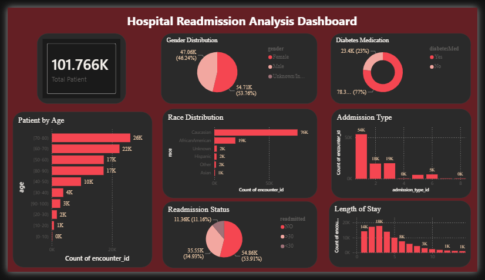

# Hospital Readmission Analysis

## Project Overview
This project predicts whether a patient is likely to be readmitted to the hospital using Machine Learning.

## Technologies Used
- Python
- Pandas
- NumPy
- Matplotlib
- Scikit-learn

## Dataset
Hospital Readmission Dataset (Diabetes 130-US Hospitals)

## Machine Learning Model
- Logistic Regression

## Features Used
- Time in Hospital
- Number of Lab Procedures
- Number of Procedures
- Number of Medications
- Number of Outpatient Visits
- Number of Emergency Visits
- Number of Inpatient Visits

## Results
- Model Accuracy: **56.75%**

## Future Improvements
- Random Forest
- XGBoost
- Feature Engineering
- Hyperparameter Tuning

## Power BI Dashboard
